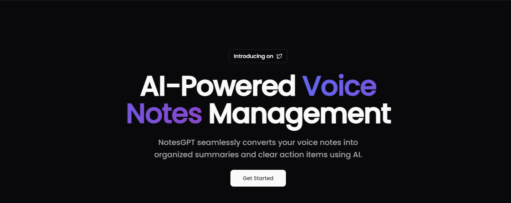

# NotesGPT



Key Features:
- Real-time voice-to-text conversion 🗣️➡️📝
- Organized summaries generation 📑
- Generate transcript using AI 📑
- Add action items ✅
- Light and Dark mode 🌓
- Authentication 🔐
- Full mobile responsiveness 📱
- Landing page 🛬

### Prerequisites

**Node version 18.x.x**

### Cloning the repository

```shell
git clone https://github.com/abdtriedcoding/notesGPT.git
```

### Install packages

```shell
npm i
```

### Setup .env file


```js
# Deployment used by `npx convex dev`
CONVEX_DEPLOYMENT=
NEXT_PUBLIC_CONVEX_URL=

NEXT_PUBLIC_CLERK_PUBLISHABLE_KEY=
CLERK_SECRET_KEY=

```

### Setup Convex

```shell
npx convex dev

```

### Start the app

```shell
npm run dev
```
